# Visualizing the Sequence: The Event Loop

**Format:** Mermaid JS
**Style:** Google DevDocs
**Scope:** Tick-to-Trade (Single Cycle)

This reference visualizes the 19ms OODA Loop execution path.

```mermaid
sequenceDiagram
    autonumber
    participant K as Kraken (Exchange)
    participant I as Ingest (Reflex)
    participant F as Feynman (Physics)
    participant B as Brain (Python)
    participant G as OODA Governor
    participant J as Trade Journal (Audit)
    participant E as Execution (Sniper)

    Note over K, I: WebSocket Feed (Public)

    K->>I: Market Tick (Price, Vol)
    I->>F: Parse & Update Kinematics
    
    rect rgb(20, 20, 30)
        Note right of F: OODA Loop Start (t=0ms)
        F->>F: Compute v, a, j (1ms)
        
        par Semantic Context (Async)
            F->>B: gRPC GetContext(Physics)
            B->>B: Hypatia (News) + Kepler (Chart)
            B-->>G: Context Response (Sentiment)
        and Jitter Fallback
            F->>G: Direct Physics Feed
        end
        
        Note right of G: Orient Phase (12ms)
    end

    G->>G: SyncGate (Check Latency < 19ms)
    
    rect rgb(40, 20, 20)
        Note right of G: Decide Phase
        G->>G: Check Vetoes (Legislative & Nuclear)
        G->>G: Apply Risk Sizing (Provisional)
    end
    
    G->>J: Log Decision Packet (Zero-Copy)
    
    alt Action == BUY/SELL
        G->>E: Submit Order Proposal
        E->>E: Check FIFO / Rate Limit
        E->>K: Send Fix/REST Order
        K-->>E: Acknowledge (Order ID)
    else Action == HOLD
        G->>E: No OP
    end
    
    Note over K, E: Loop End (Total ~15-20ms)
```

## Component Reference

1. **Ingest (`KrakenSentry`)**: Converting dirty JSON into clean Structs.
2. **Physics (`Feynman`)**: The "Truth" of the market (Velocity, Acceleration).
3. **Audit (`Gemma/Nullifier`)**: Ensuring the Narrative matches the Physics before Action.
4. **Action (`Reflex`)**: Checks liquidity queues and strikes.
